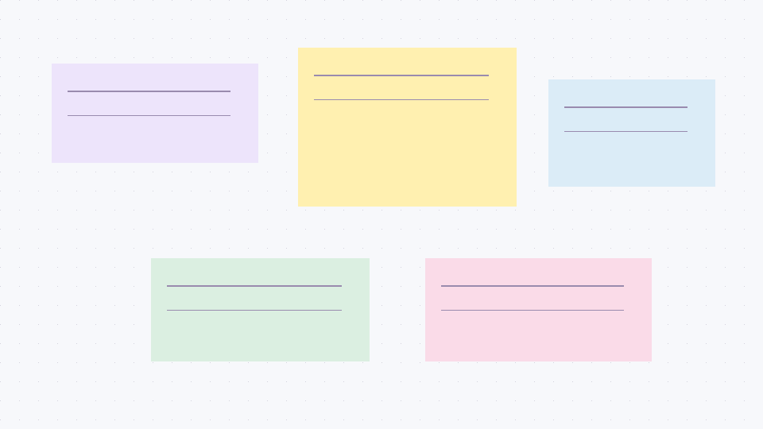

# AgentCanvas

人与 Agent 共创的持久化画布：把思路、任务、文件和讨论留在同一组对象上。

[在线体验](https://noir-hedgehog.github.io/agent-canvas/) · [下载本地版](https://github.com/noir-hedgehog/agent-canvas/releases) · [发行说明](docs/acceptance.md)



## 可以做什么

- 自适应卡片、便签、Markdown/GFM 表格和任务列表、Mermaid 图表。
- 可编辑连线、方向与关系标签；思维导图、流程图及多层子画布。
- 多选时显示统一操作栏；可组合为 Section，拖动标题栏整体移动，保留内部相对位置。支持改名、解除分组、撤销和持久化，自动布局及网格对齐也按整体处理。
- Todo / Kanban 共用任务；跨画布引用共享内容、独立布局。
- 图片、视频、Markdown 文件引用和弹窗预览；图片截图批注、视频时间点及截图批注。
- 对象批注和界面元素调试批注，编辑、状态切换、批量复制、归档与恢复；拖动卡片时鼠标进入收纳箱并松手才归档。
- 缩略图、卡片目录、自动布局（智能 / 树状 / 流程 / 网格，预览后应用）、网格对齐、字体偏好、缩放锁定。
- 本地 SQLite 保存、版本冲突检测、事务与重试去重、撤销、SSE 同步。
- 网页只读模式不影响 Agent MCP 写入；批注模式自动只读，支持整卡、文字选区和多卡片框选批注。
- 真实 STDIO MCP：项目范围的只读 / 编辑口令，读取上下文、修改原对象、回复讨论。

## 选择版本

| | GitHub Pages 演示 | 本地发行包 |
| --- | --- | --- |
| 启动 | 打开网页 | Node.js 24+，首次启动联网安装依赖 |
| 数据 | 当前浏览器的 localStorage | 本机 SQLite 和资产目录 |
| 文件 | 内置示例、HTTP(S) 直链、少量图片上传 | 工作区文件引用、托管图片 |
| Agent | 不运行 MCP、不生成口令 | STDIO MCP + 项目授权 |
| 用途 | 体验交互、查看功能与规划 | 单机持续共创 |

演示数据全部为人工编写的公开示例。清除浏览器数据或重置演示会丢失浏览器内修改；它不适合保存正式项目。应用不主动上传演示内容，页面由 GitHub Pages 托管；远程媒体链接会向目标地址发起请求。Docker 暂缓，见[评估记录](docs/public/docker-evaluation.md)。

### 网页只读与文字批注（当前源码 / Pages）

编辑模式下框选或 Shift 多选卡片，点击统一操作栏的「组合为 Section」。拖动 Section 标题栏移动整组；点击标题可改名，右侧解除分组按钮保留所有卡片和当前位置。首版不嵌套 Section，组内卡片仍可编辑内容；需要单独调整位置、尺寸时先解除分组。MCP 可通过 `create_section`、`move_section` 操作分组。

右上角的锁图标切换网页只读模式。只读期间可平移、缩放、进入已有子画布、预览文件及处理批注；不能改卡片、移动布局、连线或归档卡片。批注模式自动只读，退出后恢复进入前的编辑状态；独立开启的只读模式保持到手动关闭或刷新页面。此开关不改变项目授权或 MCP 口令权限，Agent 的更新仍实时同步。

- 整卡批注：选中卡片后点击底部批注图标，或进入批注模式再点选卡片。
- 文字批注：在只读或批注模式下选中卡片标题或 Markdown 正文中的文字，点击浮出的「批注选中文字」，填写并保存。
- 多卡片批注：从画布空白处拖动框选，或按住 Shift 点选；一次讨论请求引用所有选中卡片。

文字批注保留原文、前后文和当时的内容版本。Agent 读取最新内容后核对；渲染后的文字偏移不能直接作为 Markdown 源码偏移。原卡片更新时批注不会丢失原文。以上新交互随当前源码和 Pages 更新，既有 v0.1.0 发行归档不回写。

## 本地发行包

从 Releases 下载 `agentcanvas-0.1.0-local.tar.gz`（macOS / Linux）或 `.zip`（Windows），解压到可写目录。包内已包含构建好的前端，不需要开发工具链；**仍需安装 Node.js 24 或更高版本，并在首次启动时联网下载依赖**。

macOS / Linux：

```sh
cd agentcanvas-0.1.0-local
./start.sh
```

Windows：双击 `start.cmd`，或在解压目录的终端运行它。

出现启动提示后打开 **http://127.0.0.1:4317**。按 Ctrl+C 停止；再次运行同一启动文件即可继续。登录自启动默认关闭。端口被占用会报错，不会停止其他应用。自定义端口可设置 `AGENTCANVAS_PORT`；MCP 接入指令会使用实际端口。

首次启动建立「功能导览与路线图」示例；已存在项目不会被覆盖。项目选择菜单可以创建空白项目。当前包为早期单机版本，不提供公网服务或多人协作。

### 连接 Agent

先启动本地应用，点击「连接 Agent」，选择只读或编辑权限，生成并复制接入指令。把指令交给同机 Agent，按其中的 STDIO 配置接入 MCP；客户端可能需要重新加载或重启才能发现工具。复制并不代表已连接。

批注保存后，复制给 Agent；Agent 应先读最新对象版本，保留布局，修改原对象并回复。MCP 支持 Markdown 和 Mermaid 源码、归档状态、子画布按需读取。不要公开接入指令中的口令。撤销项目口令可终止后续授权访问；同机管理员凭据具有工作区权限。

### AgentCanvas Skill（当前源码）

在项目目录执行 `npm run skill:install`，把仓库中的 [agent-canvas Skill](skills/agent-canvas/SKILL.md) 链接到当前用户的 Codex 技能目录；已有不同来源的同名 Skill 不会被覆盖。安装后可在新会话中使用 `$agent-canvas`。移动项目目录后需要重新核对链接；安装 Skill 不会自动配置 MCP 或授予项目权限。

Skill 包含画布使用规范、Section 操作、批注处理，以及可执行的流程图、泳道分区和思维导图范例。其他 MCP 客户端也可调用 `read_usage_guide` 获取同一份指南、能力清单和范例，无需安装 Skill。新增工具需要客户端重新发现。

当前原生连线只有左侧入口、右侧出口；上下端点与自动避障尚未实现。新建原生流程图优先横向排布，已有内容保留用户布局。泳道范例通过 Section 表达职责分区，不是专门的泳道组件。Section 已支持 `create_section`、`move_section`；改名用 `update_content`，解除分组用 `apply_changes` 删除 Section 对象，保留成员卡片。

开发约定见 [AGENTS.md](AGENTS.md)：功能变更同步更新 MCP、Skill 与验收。上述指南随源码和新构建的发行包提供，既有 v0.1.0 发布归档不回写。

### 数据、备份与升级

数据默认在解压目录的 `.agentcanvas/`，包含数据库、图片、截图和本地凭据。文件引用指向原文件，不自动复制；移动原文件后需重新关联。

- 备份：停止应用，把整个 `.agentcanvas/` 复制到安全位置，同时备份引用的原文件。也可运行 `npm run backup -- /绝对路径/备份目录` 创建数据库一致性备份。
- 恢复：停止应用，将备份内容还原到 `.agentcanvas/`，再启动。备份包含凭据，应保持私密。
- 升级：先备份，解压新版到新目录，再复制 `.agentcanvas/`；引用文件的相对路径也需保持一致。不要覆盖或删除唯一的数据副本。

## 从源码运行

```sh
npm ci
npm test
npm run build
npm start
```

开发时运行 `npm run server` 和 `npm run dev`；前端端口 4318。`npm run build:demo` 构建纯静态演示到 `dist-demo/`。`npm run package:local` 从已构建的 `dist/` 生成本地发行包。

`CanvasEditor` 可独立嵌入，接受项目、画布和对象定位参数并输出选择与讨论事件；`/embed` 提供最小宿主演示。真实宿主会话、云端和多人协作尚未实现。

## 接下来的规划

全文检索与文件重连、导入导出与版本比较、大画布性能、键盘及无障碍体验、宿主会话接入与细化授权。顺序依据反馈调整；这些项目不代表已交付能力。
