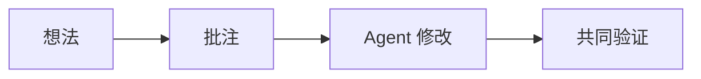

# 从想法到共同产出

这是专门编写的公开示例，没有真实项目或个人数据。

1. 在画布写下想法，用连线标注关系。
2. 进入卡片的子画布，展开细节。
3. 框选对象留下批注。
4. 在本地版连接 MCP，让 Agent 读取最新对象并更新原内容。

- [x] 持久化对象和稳定 ID
- [x] 文件引用与截图批注
- [ ] 后续规划：全文搜索、导出和性能优化

GitHub Pages 是浏览器沙盒，不运行本地服务或 Agent。
