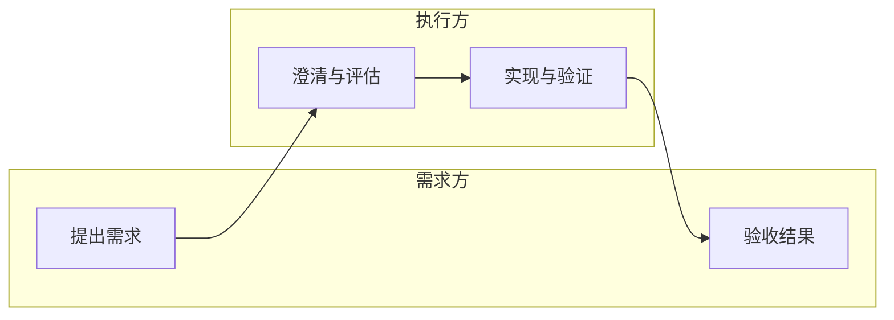

# 图表范例与排布规范

范例适用于用户授权新建的内容区域；修改既有图先读布局，不直接套用坐标。所有 JSON 范例中的 `${PROJECT_ID}`、`${CANVAS_ID}`、`${RUN}` 都要替换为实际值，RUN 每次新任务唯一。同一次调用重试复用原 RUN。

执行顺序为 calls 数组顺序。每个结果检查 isError，失败就停在该步骤；重新读取已成功创建的对象后修复或按相同 requestId 重试，避免整套重复创建。坐标为逻辑画布坐标；考虑实际文字高度，必要时扩大间距。

## 流程图：横向主线 + 条件回路

用 native flow 节点表达开始、处理、判断、结束；放在同一个 graphId 内。有向边 source/target 用内容对象 ID，标签使用“是”“否”“重试”等简短语义。示例把主线从左向右排；回退仍是普通贝塞尔连线，**不保证自动避开卡片**。大回路密集时拆子画布或改用 Mermaid；支持四边端点，但不要宣称已支持正交避障或手动折点。

执行范例：[../examples/flowchart.json](../examples/flowchart.json)。包含同一图的四个节点、判断分支和返回处理节点的回路；按用户指定的阅读方向安排新内容，已有图不擅自重排。

## 纵向流程：上进下出 + 侧边回路

执行范例：[../examples/vertical-flow.json](../examples/vertical-flow.json)。主线固定 sourceSide=bottom、targetSide=top，判断回退固定 left→left，为主线留出空间。节点坐标、关系方向与端点选择分开保存；切换端点不需要移动卡片。自动选边会在卡片移动、尺寸测量更新后重新计算；需要稳定方向时固定两端。没有自动避障，密集图应检查回路是否穿过其他卡片。

## 泳道图：职责分区 + 跨区交接

用一个 Section 表示一个角色或责任域，卡片是阶段输出或动作，时间/顺序从左向右；跨角色交接使用箭头，默认自动选边；需要纵向交接时固定 bottom→top 或 top→bottom。先建卡片和关系，最后按角色组合 Section，避免对已固定的成员逐个重排。Section 按内容包围，不是齐头等宽的原生泳道；当前不支持嵌套。

执行范例：[../examples/swimlane.json](../examples/swimlane.json)。两条职责分区、四个动作、三次交接，组内保持相对位置。完成后读取 Section 和成员位置，确认跨区连线的端点仍为原 placement。

仅需一张说明图时，可以在 card.body 写：

这是 Mermaid 的角色分区表示，内部节点不能逐个作为卡片操作。不要把“Section 分组”和“流程层级父子关系”混用。

## 思维导图：主题逐层展开

优先 `create_diagram_card(diagramType="mind")`，随后 `read_canvas` 读取其 childCanvasId。复用已有中心节点和分支；追加 mind 节点时复用 graphId，parentId 为同图的 mind 对象 ID。向右展开，兄弟节点垂直排列，禁止父子循环。一个分支内容过多时，进入它的子画布细化。

执行范例：[../examples/mind-map.json](../examples/mind-map.json)。创建完整图卡片并读取其内部起始节点，不再重复创建另一套中心节点。

## 交付前核对

读取实际新对象和连线，确认标签、方向、同层引用、Section 成员及预期版本。已有画布的非目标对象位置应保持不变。协议验证只说明对象与关系写入正确；如尚未查看实际渲染，不声称线条无重叠或图形布局已经视觉验收。
